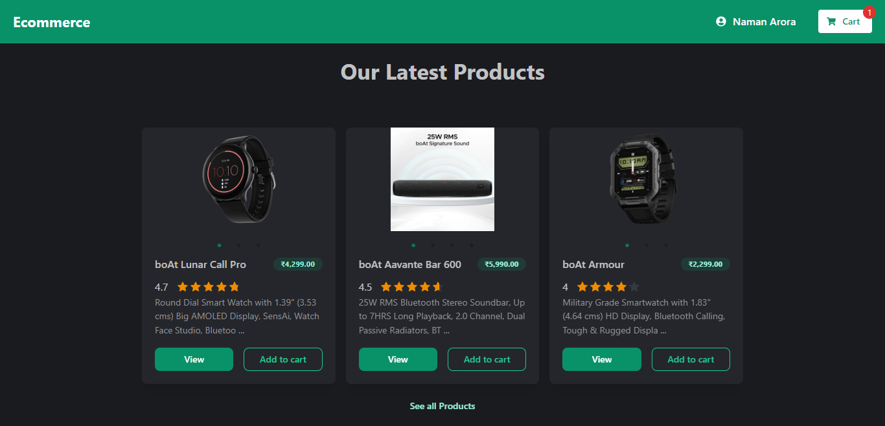
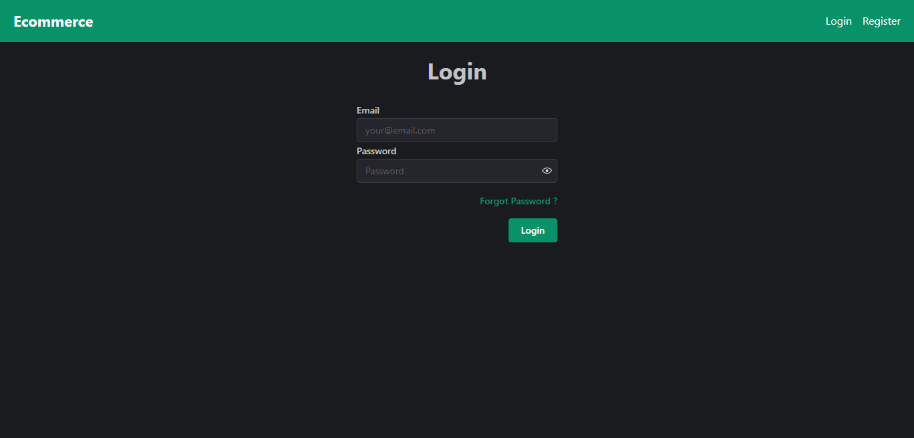
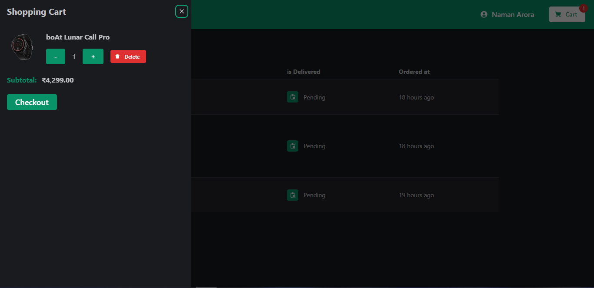
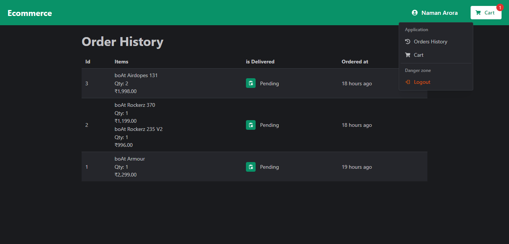
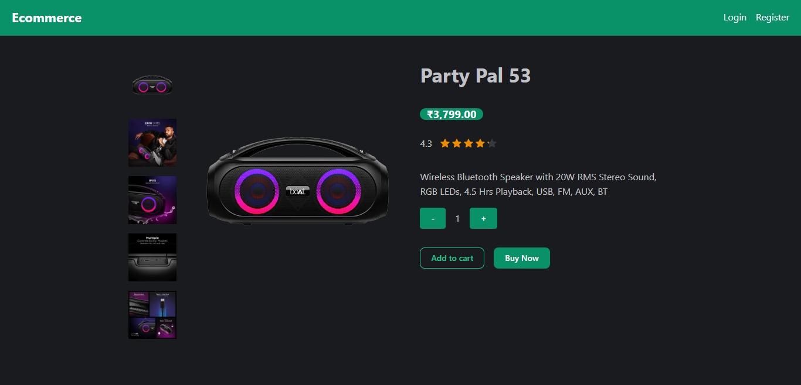
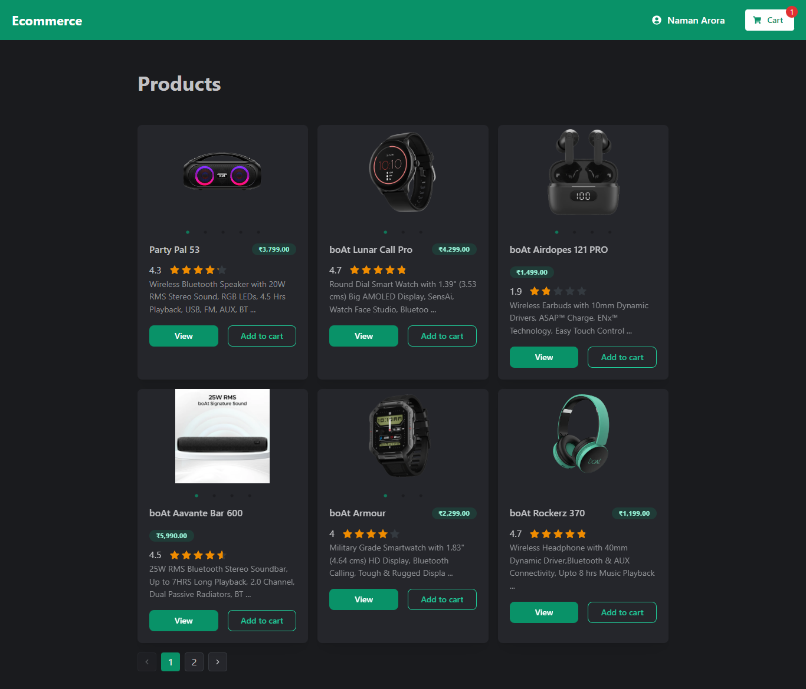
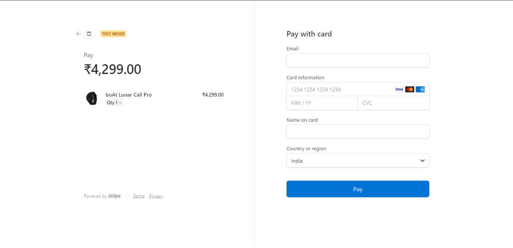
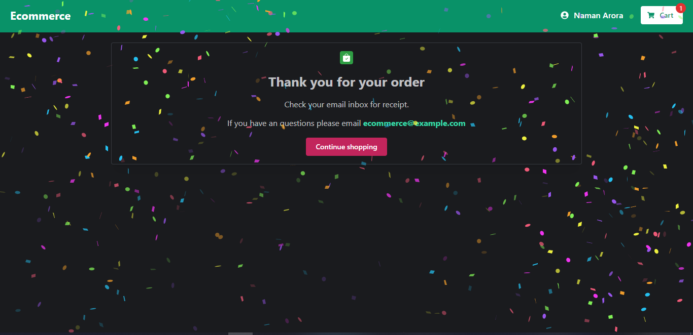

# 🛒 Ecommerce Webiste

Website is live at https://ecommerce1022.vercel.app

Note: I have only hosted the frontend and sanity for this project backend is not hosted so some features make not work properly.You can clone this git repo and run it locally to see this project working.I have also added some screenshots below of the working website.

## 🐈 Features

-   Login
-   Register
-   Forgot Password
-   Confirmation Email
-   Add to cart
-   Remove from cart
-   Change Quantity of an item in cart
-   Products page with Pagination
-   Product details page
-   Checkout with stripe
-   Orders History

## 📷 Screenshots

## ⚙ Technologies

-   ### Frontend
    -   Next Js
    -   Axios
    -   Day Js
    -   Zustand
    -   Mantine
    -   React Query
    -   Typescript
-   ### Backend
    -   Nest Js
    -   Prisma ORM
    -   PostgresSQL
    -   Argon2
    -   Redis
    -   JWT (with access and refresh tokens)
    -   Node mailer
    -   Stripe
-   ### Content Management System
    -   Sanity

## 🙋‍♂️ Stay in touch

-   Author - [Naman Arora](https://namanarora.vercel.app)
-   Website - [https://namanarora.vercel.app](https://namanarora.vercel.app)
-   Twitter - [@namanarora1022](https://twitter.com/namanarora1022)

## 📝 License

[MIT licensed](LICENSE).
